# Application Documentation

## 1 Scope

The application is a website for an independent music producer. The website
presents a discography. The website presents a journal. The website provides a
contact page.

The website runs on Next.js. The website runs on one Node.js process. The
website stores music data in a SQLite database. The website stores journal posts
as source code.

Section 2 through Section 19 describe the structure and the operation of the
website.

---

## 2 Technology

| Item | Value |
|---|---|
| Framework | Next.js 16.3, App Router |
| User interface | React 19.2 |
| Compiler | React Compiler, enabled |
| Language | TypeScript, strict mode |
| Database | SQLite through Drizzle ORM |
| Markdown | react-markdown through remark-gfm |
| Style | Hand-written CSS with custom properties |
| Test | Vitest |
| Node.js | Version 26 or later |

The build tool is Turbopack. The build tool is the default for Next.js 16.

---

## 3 System structure

The application has three layers. The browser layer runs React components. The
server layer runs pages and API routes. The storage layer holds files and data.

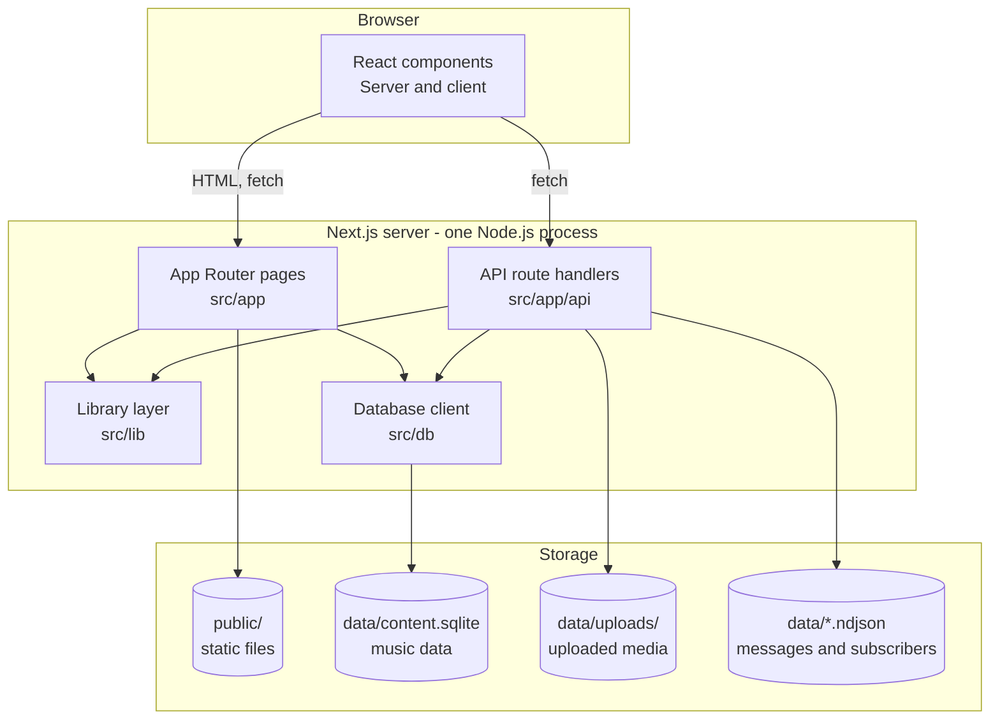

The journal pages do not use the database layer. Section 8 describes this
separation.

---

## 4 Request processing

Next.js processes each request through a fixed sequence. The order depends on
the presence of a cache entry.

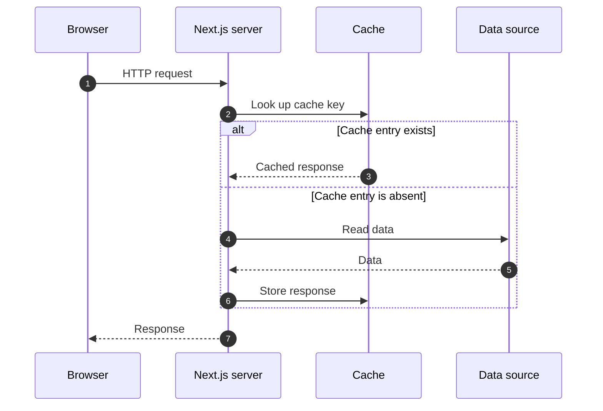

The cache applies to music data. The cache applies to static assets. The cache
does not apply to journal pages. Journal pages read source code on each request.

---

## 5 Routes

The application uses a locale segment. The segment has three permitted values.

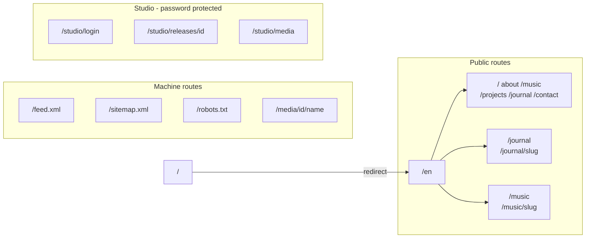

The locale segment applies to the public routes. The locale segment does not
apply to the studio routes. The studio uses one locale.

---

## 6 Locales

The application supports three locales.

| Locale | Code | Direction |
|---|---|---|
| English | `en` | Left to right |
| Japanese | `ja` | Left to right |
| Mongolian | `mn` | Left to right |

The locale segment selects the interface text. Each locale has one dictionary
file.

| File | Content |
|---|---|
| `src/messages/en.json` | English interface text |
| `src/messages/ja.json` | Japanese interface text |
| `src/messages/mn.json` | Mongolian interface text |

A request with an unknown locale segment returns the not-found page. The route
`/` redirects to `/en`.

Journal post bodies are available in English only. The journal route serves the
same body for all three locales.

---

## 7 Data storage

The application uses four storage locations. Three locations are not tracked in
git.

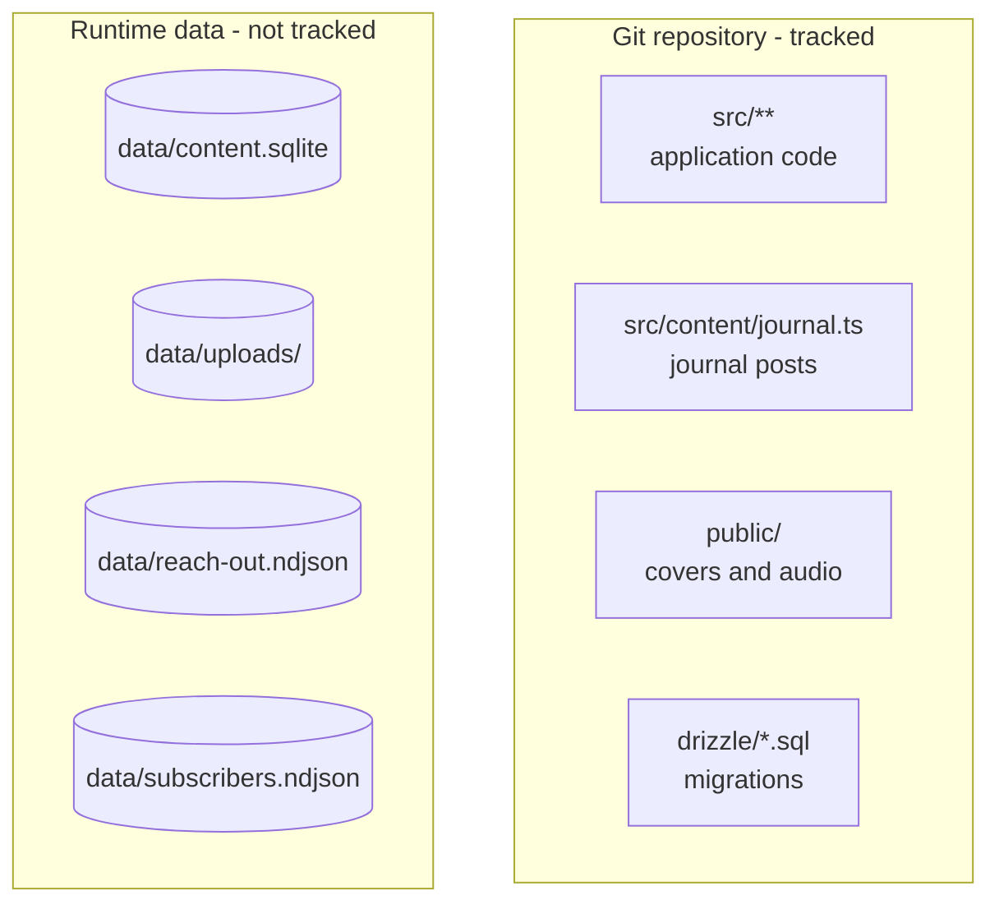

Journal posts are tracked in git. Music data is not tracked in git. The backup
procedure in Section 16 copies the runtime data.

### 7.1 Database tables

The database contains three tables. The studio manages each table. The journal
uses none of the tables.

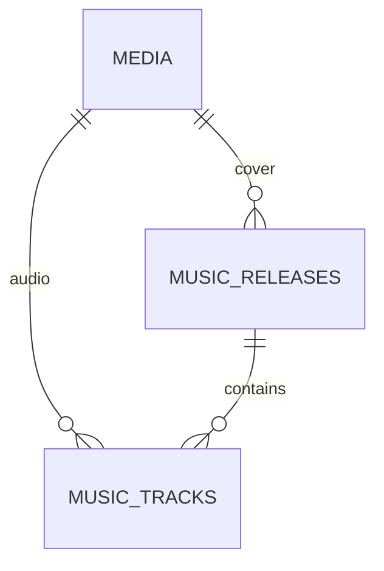

| Table | Purpose |
|---|---|
| `media` | Image and audio files |
| `music_releases` | Release metadata |
| `music_tracks` | Track order, lyrics, audio reference |

Migration `0002_drop_journal_tables` removed the four earlier journal tables.
Section 8 describes journal data as source code.

---

## 8 Journal

### 8.1 Data flow

The journal stores each post as one TypeScript object. The object contains a
Markdown body. No database is involved. No publish action is required.

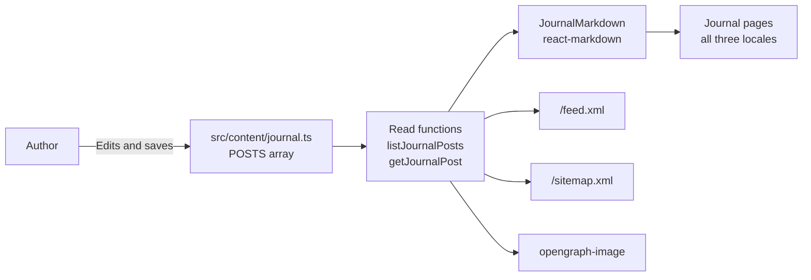

### 8.2 Post fields

| Field | Type | Requirement |
|---|---|---|
| `slug` | string | Required. The value must be unique. |
| `title` | string | Required. The value appears as the page heading. |
| `excerpt` | string | Required. The value appears on cards and in the feed. |
| `type` | string | Required. The value is a short label. Example: `studio note` |
| `coverPath` | string or null | Optional. The value is a path in `public/`. |
| `coverAlt` | string or null | Required when `coverPath` is set. |
| `publishedAt` | string | Required. The value is a date in ISO format. |
| `tags` | array | Optional. Each item has a `name` and a `slug`. |
| `bodyMarkdown` | string | Required. The value is Markdown text. |

### 8.3 Derived values

The application calculates two values for each post.

| Value | Source |
|---|---|
| Post order | The `publishedAt` field, newest first |
| Reading time | The word count of `bodyMarkdown` |

The order of entries in the array has no effect on the page order. The newest
post appears in the large feature card. The other posts appear in a grid.

### 8.4 Add a post

1. Open `src/content/journal.ts`.
2. Locate the `POSTS` array.
3. Add an object at the start of the array.
4. Set the `slug` field to a value that no other post uses.
5. Set the `publishedAt` field to a date in ISO format.
6. Set the `bodyMarkdown` field to the post text in Markdown.
7. Save the file.
8. Start the application with `npm run dev`.
9. Open `http://localhost:3000/en/journal`.
10. Verify that the post appears in the grid or in the feature card.
11. Open the post page.
12. Verify that the body renders correctly.

The post is public after the file is saved. The post requires no build step. The
post requires no database write.

### 8.5 Remove a post

1. Open `src/content/journal.ts`.
2. Locate the object for the post.
3. Delete the object.
4. Save the file.
5. Verify that the post route returns the not-found page.

### 8.6 Markdown support

The renderer supports GitHub Flavored Markdown. The renderer supports headings,
lists, tables, links, images, and block quotes.

The renderer does not support raw HTML. The renderer does not support the
`::audio` directive. The directive requires the `media` table. Section 7.1
describes this table.

To add an image, place the file in `public/covers/`. Use a Markdown image
reference in the body.

```markdown

```

---

## 9 Music releases

### 9.1 Data flow

Music data resides in the database. The studio writes this data. The public
pages read this data.

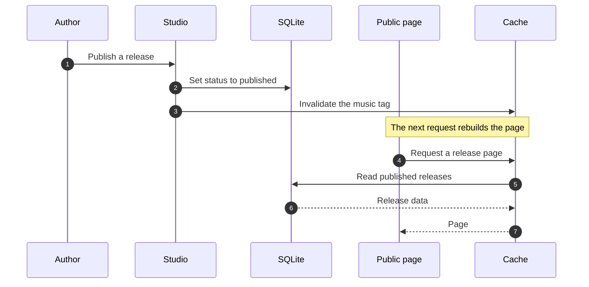

### 9.2 Publish requirements

A release appears on the public site after these conditions are true.

| Condition | Field |
|---|---|
| The status is `published` | `status` |
| The release has a title | `title` |
| The release has a description | `descriptionMarkdown` |
| The release has at least one track | `music_tracks` |

The studio prevents the publish action until each condition is true. The studio
returns status 422 with a list of missing fields.

### 9.3 Create a release

1. Run `npm run dev`.
2. Open `http://localhost:3000/studio`.
3. Log in at `/studio/login`.
4. Open the Writing section.
5. Select the music section.
6. Select `new release`.
7. Set the title.
8. Set the slug.
9. Add at least one track.
10. Add a cover image and alt text.
11. Select `publish`.

### 9.4 Track audio

A track has an audio kind. The table lists the permitted values.

| Value | Behavior |
|---|---|
| `none` | The page shows no player. |
| `preview` | The page shows a preview player. |
| `full` | The page shows a full-length player. |

The audio file stores in `data/uploads/audio/`. The database stores a reference
in the `media` table. The route `/media/{id}/{name}` serves the file.

---

## 10 Studio access control

### 10.1 Overview

The studio protects each request with two checks. The first check verifies the
request origin. The second check verifies the session cookie.

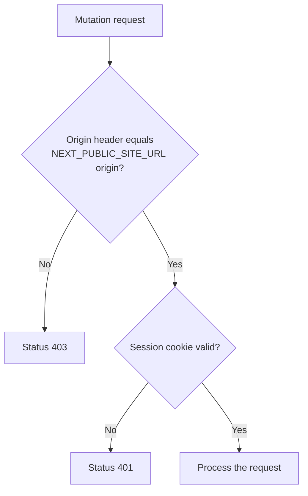

The origin check applies to each write request. The origin check prevents
cross-site requests from a different site. The origin check fails when
`NEXT_PUBLIC_SITE_URL` is absent. This condition causes each write to return
status 403.

### 10.2 Login sequence

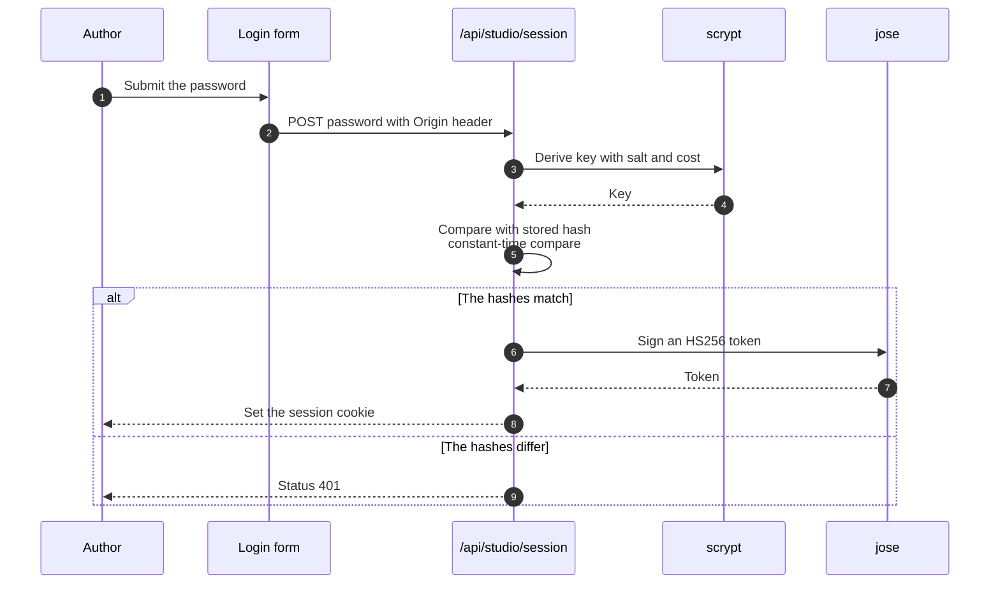

### 10.3 Password storage

The application stores two values for each password. The values are the salt and
the hash. The application does not store the password itself.

| Item | Value |
|---|---|
| Algorithm | scrypt |
| Cost | 16384 |
| Block size | 8 |
| Parallelization | 1 |
| Key length | 64 bytes |
| Salt length | 16 bytes |

The comparison function is `timingSafeEqual`. This function prevents a timing
attack.

### 10.4 Session token

The session token has these properties.

| Property | Value |
|---|---|
| Algorithm | HS256 |
| Subject | `owner` |
| Required claims | `sub`, `iat`, `exp` |
| Maximum lifetime | 7 days |

The signing secret is the value of `STUDIO_SESSION_SECRET`. The secret must
decode to at least 32 bytes. The application rejects a shorter secret.

The cookie name depends on the environment.

| Environment | Cookie name |
|---|---|
| Development | `kotakunp-studio-dev` |
| Production | `__Host-kotakunp-studio` |

Each cookie has these flags: `HttpOnly`, `SameSite=Strict`, and `Path=/`. The
production cookie also has the `Secure` flag.

### 10.5 Request size limits

The route `/api/studio/media` accepts large files. The server accepts a body of
150 MiB. A reverse proxy must permit the same size. The default proxy limit is
too small for audio uploads.

---

## 11 Media service

The route `/media/{mediaId}/{name}` serves uploaded files. The route checks the
database before it reads a file from disk.

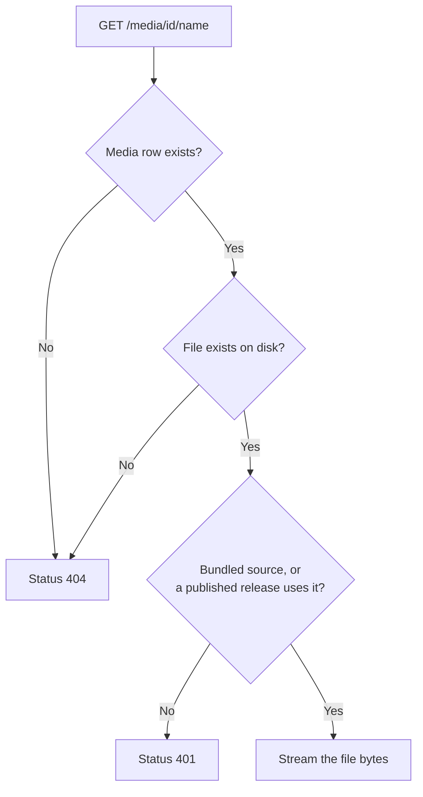

The route returns status 401 for an unpublished parent. This response discloses
that the media identifier exists. The route returns status 404 for an absent
row or an absent file. A file with `source` value `bundled` is always public.

---

## 12 Message wall

The contact page posts messages to `/api/messages`. The route appends each
message to a text file. The route does not use the database.

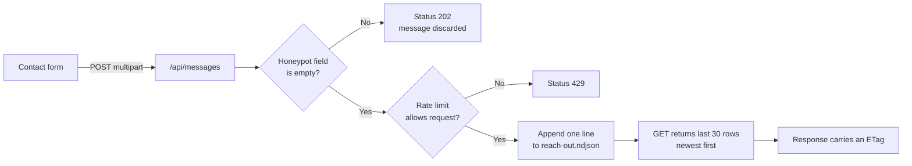

The file path is `data/reach-out.ndjson`. Each line contains one JSON object.
The file is not tracked in git.

**Limits.** Each IP address is able to send 5 messages per hour. The limit state
resets when the process restarts. The state is not shared between instances. A
serverless platform removes the file on each deployment. The application does
not moderate messages.

---

## 13 Newsletter

The music page posts an address to `/api/subscribe`. The route appends each
address to a text file. The route also sends the address to an external
provider.

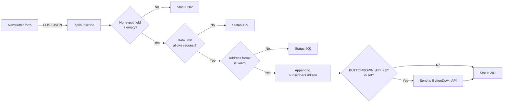

The rate limit is 5 requests per hour for each IP address. A honeypot field in
the form traps automated submissions. The route returns status 202 for a
honeypot submission. The route discards that submission.

---

## 14 Design system

### 14.1 Colour tokens

The stylesheet defines each colour as a custom property in `:root`.

| Token | Purpose |
|---|---|
| `--paper` | Page background |
| `--ink` | Main text |
| `--muted` | Secondary text |
| `--faint` | Tertiary text |
| `--rule` | Border lines |
| `--soft` | Subtle background |

### 14.2 Typography

The site uses monospace type for all text. The stylesheet composes each font
stack from three sources.

| Token | Font |
|---|---|
| `--font-geist` | Geist |
| `--font-geist-mono` | Geist Mono |
| `--font-jp` | Noto Sans JP, weights 400 and 500 |

### 14.3 Article styles

The class `.mdx-content` styles rendered Markdown. The class name is a
historical name from an earlier Markdown setup. The class name remains in use.

| Selector | Applies to |
|---|---|
| `.mdx-content h1` | Article headings |
| `.mdx-content p` | Paragraphs |
| `.mdx-content blockquote` | Block quotes |
| `.mdx-content code` | Inline code |

The class `.journal-article` styles the article page. The class
`.journal-featured` styles the feature card. The class `.journal-card` styles
each grid card. The class `.journal-grid` arranges cards in two columns.

The project uses hand-written CSS. Tailwind CSS is a dependency. The
components do not use Tailwind utility classes. Add new prose styles under the
selector `.mdx-content`.

---

## 15 Development

### 15.1 Prerequisites

1. Install Node.js version 26 or later.
2. Install the project dependencies.

   ```sh
   npm install
   ```

### 15.2 Prepare the environment file

1. Copy the example file.

   ```sh
   cp .env.example .env.local
   ```

2. Generate the password values.

   ```sh
   printf 'your-password' | npx tsx scripts/content/hash-password.ts
   ```

3. Copy the two printed values into `.env.local`. Set `STUDIO_PASSWORD_SALT`.
   Set `STUDIO_PASSWORD_HASH`.
4. Generate the session secret.

   ```sh
   openssl rand -base64 32
   ```

5. Set `STUDIO_SESSION_SECRET` to the printed value.
6. Set `NEXT_PUBLIC_SITE_URL` to `http://localhost:3000`.

The variable `NEXT_PUBLIC_SITE_URL` is mandatory for studio writes. Each write
returns status 403 when the variable is absent. Section 10.1 describes this
check.

### 15.3 Prepare the database

The website requires the database. The runtime client does not create the
database.

1. Run the migration.

   ```sh
   npm run db:migrate
   ```

2. Verify that the file `data/content.sqlite` exists.

The journal does not require the database. The music pages require the database.
Section 8.1 describes this separation.

### 15.4 Start the development server

```sh
npm run dev
```

The server listens on port 3000. Open `http://localhost:3000`. The server
redirects the root path to `/en`.

### 15.5 Verify the installation

1. Open `http://localhost:3000/en/journal`.
2. Verify that the journal lists the posts.
3. Open one post page.
4. Verify that the body renders.
5. Open `http://localhost:3000/en/music`.
6. Verify that the discography lists the releases.
7. Open `http://localhost:3000/studio/login`.
8. Verify that the login form accepts the password.

---

## 16 Build and deployment

### 16.1 Verification commands

Run these commands before each deployment.

```sh
npm run lint
npm test
npm run build
```

| Command | Expected result |
|---|---|
| `npm run lint` | Exit code 0 |
| `npm test` | All test files pass |
| `npm run build` | Exit code 0 |

### 16.2 Build

```sh
npm run build
```

The build command fails when `data/content.sqlite` is absent. Run
`npm run db:migrate` first.

### 16.3 Deployment order

1. Copy the application to the server.
2. Set the environment variables in Section 15.2.
3. Run `npm run db:migrate`.
4. Start the Node.js process.
5. Verify that the process serves `/en`.

Never start the application against an absent database. The runtime client
refuses to create the database. This refusal prevents a path error from
starting an empty database.

The application requires a long-running Node.js process. A serverless platform
removes the runtime files on each deployment. Section 12 describes this limit.

### 16.4 Backup

The backup command copies the database and the uploads.

```sh
CONTENT_DATABASE_PATH=/abs/path/content.sqlite \
CONTENT_UPLOADS_PATH=/abs/path/uploads \
CONTENT_BACKUP_PATH=/abs/path/backups \
npm run content:backup
```

The command uses `sqlite3 .backup`. The command is consistent under WAL mode.
The command writes a checksum file and a manifest.

Run the restore drill each month.

```sh
bash scripts/backup/restore-check.sh /abs/path/backups/<timestamp>
```

The drill verifies checksums. The drill verifies database integrity. The drill
does not modify live data.

Journal posts require no backup. Journal posts are tracked in git.

---

## 17 Cache behaviour

| Tag | Data | Invalidated by |
|---|---|---|
| `music` | Releases and tracks | A studio write to a published release |

The journal pages do not use the cache. The journal pages read source code.

The route `/feed.xml` reads journal source code. The route `/sitemap.xml` reads
journal source code and music data.

---

## 18 Add a page

1. Create the file `src/app/[lang]/example/page.tsx`.
2. Export an async function component as the default export.
3. Read the locale from the route parameters.
4. Call `notFound()` for an unknown locale.
5. Call `getDictionary(lang)` for the interface text.
6. Add the page path to the `pages` array in `src/app/sitemap.ts`.
7. Run `npm run build`.
8. Verify that the page appears in the sitemap.

Each page uses the layout in `src/app/[lang]/layout.tsx`. Each page renders
`SiteHeader` and `SiteFooter`. Each page uses the class `page-width`.

---

## 19 Known limits

| Limit | Detail |
|---|---|
| Journal locales | Bodies exist in English only. |
| Journal drafts | No draft state exists. A post is public after the file save. |
| Rate limit state | Resets on restart. Not shared between instances. |
| Message moderation | The application does not moderate messages. |
| Serverless deployment | Runtime files do not survive a deployment. |